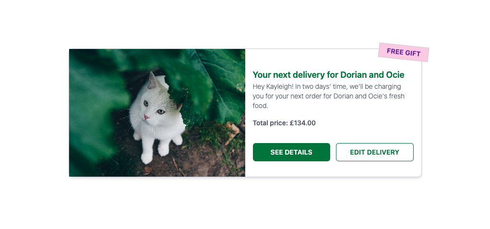
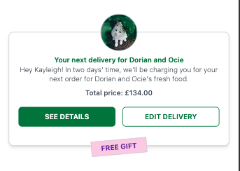

# Next Delivery Page

## Project Overview

This project is a responsive web application built with Create React App (CRA) and written in TypeScript. Styling is handled using Tailwind CSS for a clean and modern UI. The frontend is fully responsive and designed to work seamlessly across both mobile and desktop devices.

## Backend

The backend for this project is located in a separate repository and can be found [here](https://github.com/elenaharan/next-delivery-page-backend).  
This repository includes instructions on how to set up and run the backend locally.

## Frontend

To run the frontend:

1. Clone this repository:
   `git clone https://github.com/elenaharan/next-delivery-page.git`

2. Install dependencies:  
   `npm i`

3. Start the development server:  
   `npm run start`

The frontend will be available at http://localhost:5173.

## API Endpoint

The frontend application makes a request to the following endpoint:  
`http://localhost:3000/comms/your-next-delivery/{userId}
`

The {userId} at the end of the URL should be replaced with any valid user ID found in the data.json file located in the backend project.

CORS has been configured on the backend, so requests from the frontend should not encounter any browser-related restrictions or issues.

## Desktop View

## Mobile View

